<center><h2>中山大学数据科学与计算机学院本科生实验报告</h2></center>

<center><h4>（2019年秋季学期）</h4></center>

**课程名称：区块链原理与技术			任课老师：郑子彬**								

| 年级     | 大三        | 专业（方向） | 软件工程         |
| -------- | ----------- | ------------ | ---------------- |
| 学号     | 17343097    | 姓名         | 区梓俊           |
| 电话     | 15013015890 | Email        | 953024504@qq.com |
| 开始日期 | 12月1号     | 完成日期     | 12月13号         |

### 一、项目背景

1. 在传统的供应链金融中，债务的创建与转让十分频繁，很多公司常常会因为资金不足而签订应收账款单据，同时这个过程可以拉上金融机构例如银行来对这笔交易作见证，确认这笔交易的真实性。
2. 同时，下游公司也有会有资金周转问题，其因为债务上游公司信用良好，可以通过债务转让来代替资金。
3. 然而，后面的公司想要使用这一个债务向金融机构贷款就比较麻烦了，假如债务前任公司的信用不够，那么就需要继续找上游公司，这样子就需要联系好几个公司来进行信用分析，这样子公司债务上游企业的信用不能直接得到，大大减小了效率，同时也造成了许多不必要的人力、物力浪费。

### 二、方案设计

使用框架：

Springboot

#### 2.1 功能简介

1. 将供应链上的每一笔交易和应收账款单据上链，确保交易和单据的真实性，同时使得每个交易都可追溯、不可篡改，增加了交易的可信程度。
2. 同时引入第三方可信机构来确认这些信息的交易，例如银行，物流公司等，对每个交易、保单债务进行确认，确保交易的合法信，以及可以通过公司来对这些交易产生的债务、贷款进行评级。
3. 引入公司信用评价准入机制，由有信用的公司、银行等进行准入评估，符合信用的公司债务在供应链中的转移可以直接进行，同时将公司的相关的关键信息添加到链上，实现各参与方之间的信息透明，降低信任成本。
4. 使用收据进行债务、贷款记录并且上链，通过调整债务的数额进行债务的转移以及清算，同时支持高信用的应收账款转让， 融资等，实现债务信息共享，实现效益最大化。
5. 核心企业的信用可以传递到供应链的下游企业，减小中小企业的融资难度。核心企业发起的债务为高信用债务，可以进行债务转移以及用于贷款。而上游为核心企业的债务多次转移后，不管后面的企业是否为核心企业，债务仍为高信用债务，从而降低风控成本；而未确认的债务则不能够进行转移。

####2.2 信息存储

* 公司信息

  公司的信息可以根据实际情况进行添加，这里列出大概需要的信息，首先是公司名字，用于区别每个公司；地址、性质为公司信息，用于给用户参考；而公司信用等级则用于债务评级以及转移、创建中，作为判断该公司是否为有信用的核心公司。

~~~
struct Company {
		string name;
		string add;
		string property;
		StateType credit;
		address addr;
	}
~~~

* 收据信息

  收据的信息主要记录交易的双方公司，通过各自公司的名字作为唯一标识实现，同时每一个收据都有一个金额的数量，表示该笔交易涉及的金额大小。同时收据既记录公司之间的债务，包括源债务以及转移后的债务，同时也记录了公司与银行的贷款。收据有五个不同的状态，分别为未确认（尚未确认且债务上游不未核心公司）、可信的（核心公司交易）、失效（公司贷款后相关的可信债务不可使用）、贷款（公司向银行贷款的记录）、已还（已还清的债务信息）。

~~~
struct Receipt {
		bytes32 from;				//from为收据的拥有者，同时表示债务的上游公司或者是贷款中的银行
		bytes32 to;					//to为欠款者，债务或者贷款的下游公司
		uint mount;					//债务、贷款金额的
		StateType status;		//表示收据的性质以及状态
		address fromadd;		//from的地址
		address toadd;			//to的地址
	}
enum StateType { Unknown, Crediable, Disable, Loan, Payback }
//收据有五个不同的状态，分别为未确认、可信的、失效、贷款、已还
~~~

* 收据及公司信息上链

  为了方便查找对应公司的信息，使用mapping来存储每个公司的struct，用每个公司账号的地址作为key。另外就是每个公司以及其拥有的收据的映射，方便每个公司的贷款以及债务账单的转移。

```
mapping (address => uint) public companysMap;
Company[] public companys;
Receipt[] public receipts;
uint public r_num;
uint public c_num;
```


#### 2.3 

数据流图

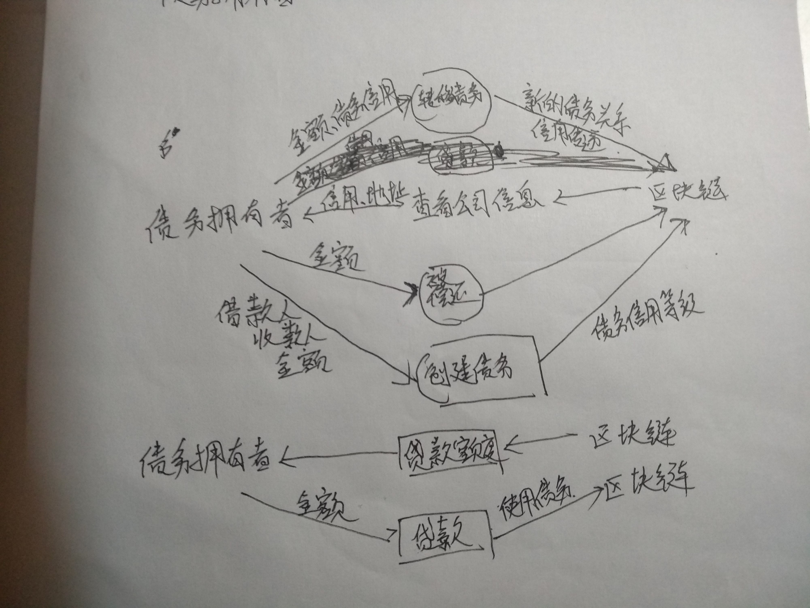

* 这里主要以债务的拥有者作为使用主体，通过区块链使得他们的债务的信用以及价值得以体现和传递下去，同时，在借债的时候也可以在区块链中查找相应的信息来评价借方的信用。

#### 2.4 核心功能介绍

1. 实现采购商品、签发应收账款交易上链。

   * from 		//from为收据的拥有者，同时表示债务的上游公司或者是贷款中的银行
   * to             //to为欠款者，债务或者贷款的下游公司
   * mount    //债务、贷款金额的

   任何的用户都可以将交易上链，不过当用户将交易上链后会判断提交交易的用户以及借款人的信用等级，从而创建对应信用等级的债务收据。当提交交易的人信用良好（如核心企业以及银行），或者借款人是高信用等级时就表明该交易是高信用的，就可以创建一个高信用的收据，否则默认为未知（unknown）。收据的地址是为了方便代码编写。

~~~
function addReceipt(address from, address to, uint mount, StateType status) {
		r_num = r_num + 1;
		receipts.push(Receipt({
						from: companys[companysMap[from]].name,		
						to:  companys[companysMap[to]].name,
						fromadd: from,
						toadd: to,
						mount: mount,
						status: status
					}));
	}
~~~

2. 实现应收账款的转让上链。

   * from         //from为收据的拥有者，同时表示债务的上游公司
   * to             //转移后债务或者贷款的下游公司
   * mount    //转移债务金额的

   转移账款函数调用时，会遍历转移者拥有的高信用的收据，将收据转移给下家，直到对应的金额达到传入的函数后，将实际转移数目返回给用户。遍历每个收据的时候，如果大于目标转移金额，则该收据保留，只是减去对应的数目；如果小于目标金额，那么就disable这个收据，然后遍历下一个目标。同时只有高信用的收据才能进行转移。

~~~
function transferMount(address from, address to, uint mount) public returns (uint){
		uint tem = mount;
		for (uint i = 0; i < receipts.length; i ++ ) {
			if (strcom(receipts[i].from, companys[companysMap[from]].name)
			//只有属于自己的债务才能够操作
				&&(receipts[i].status == StateType.Crediable
				|| receipts[i].status == StateType.Unknown)){
				//信用未知以及高信用都能转移，同时将其信用等级传递下去
				if (receipts[i].mount <= tem) {
				//没有转移足够的金额
					tem -= receipts[i].mount;
					addReceipt(companys[companysMap[to]].addr, receipts[i].toadd, receipts[i].mount, receipts[i].status);
					receipts[i].status = StateType.Disable;
					receipts[i].mount = 0;
				} else {
				//所拥有的债务金额大于所需转移
					addReceipt(companys[companysMap[to]].addr, receipts[i].toadd, tem, receipts[i].status);
					receipts[i].mount -= tem;
					tem = 0;
				}
			}
			if (tem == 0)
				break;
		}
		emit transferE(companys[companysMap[from]].name, companys[companysMap[to]].name, mount - tem);
		//返回转移成功的金额
		return mount - tem;
	}
~~~

3. 利用应收账款向银行融资上链

   * to          //贷款的公司

   该函数调用时会遍历贷款者所拥有的所有收据，并统计其中高信用的收据数额，同时disable贷款后冻结的收据，防止同一单据多次贷款，最后返回用户贷款成功的。

~~~
function loan(address to, uint mount) public returns (uint){
		uint origin = mount;
		for (uint i = 0; i < receipts.length; i ++ ) {
			if (strcom(receipts[i].from, companys[companysMap[to]].name)
				&& receipts[i].status == StateType.Crediable) {
				//只有属于自己的高信用债务才能用于贷款
				if (mount >= receipts[i].mount){
					receipts[i].status = StateType.Disable;
					mount -= receipts[i].mount;
				}
				else {
					receipts[i].mount -= mount;
					mount = 0;
				}
			}
			if (mount == 0)
				break;
		}
		addReceipt(master, companys[companysMap[to]].addr, origin - mount, StateType.Loan);
		emit loanE(companys[companysMap[to]].name, origin - mount);
		return origin - mount;
	}
~~~

4. 应收账款支付结算上链

   - from 		//from为收据的拥有者，同时表示债务的上游公司或者是贷款中的银行
   - to             //to为欠款者，债务或者贷款的下游公司
   - mount    //债务、贷款金额的

   该函数调用会遍历被还款人所有的收据，然后找到所有还款人一致的收据，然后还清对应的债务，这里如果还款金额大于等于收据，那么久将该收据设置为已还；如果不足则从该债务中减去对应的数额，最后返回成功偿还的债务金额。

~~~
function payBack(address from, address to, uint mount) public returns (uint){
		uint tem = mount;
		for (uint i = 0; i < receipts.length; i ++ ) {
			if (strcom(receipts[i].to, companys[companysMap[to]].name)
			    &&strcom(receipts[i].from, companys[companysMap[from]].name)
			    &&(receipts[i].status == StateType.Crediable
				|| receipts[i].status == StateType.Unknown)) {
				//找到对应的还钱收据
				if (receipts[i].mount <= tem) {
					tem -= receipts[i].mount;
					receipts[i].status = StateType.Payback;
					receipts[i].mount = 0;
				} else {
					receipts[i].mount -= tem;
					tem = 0;
				}
			}
			if (tem == 0)
				break;
		}
		emit paybackE(companys[companysMap[from]].name, companys[companysMap[to]].name, mount - tem);
		return mount - tem;
	}
~~~

5. 添加高信用公司

   该函数用于添加高信用的公司，这里要求调用者已经是高信用的机构，进行过评估后才能够调用。

~~~
function addCrediableCompany(address a, string n, string ad, string p) public{
		require (companys[companysMap[msg.sender]].credit == StateType.Crediable, "you don't have the right");
        uint len = companys.length;
        c_num = c_num + 1;
        companysMap[a] = len;
        companys.push(Company({name:n,add:ad, property:p,credit:StateType.Crediable, addr:a}));
	}
~~~

6. 添加未评级公司

   该函数添加公司入链，将信用状态设置为unkown。

```
function addUnknowCompany(address a, string n, string ad, string p) public{
        uint len = companys.length;
        c_num = c_num + 1;
        companysMap[a] = len;
        companys.push(Company({name:n,add:ad, property:p,credit:StateType.Unknown, addr:a}));
	}
```


### 三、功能测试

#### 1. 添加公司:

首先是登录前，该应用的后端有一个专门的账号，合约部署后会自动添加部署的用户为"masterbank"。

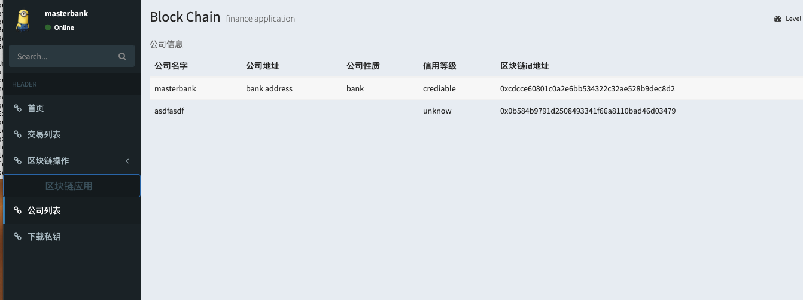

​	在列表中可以看到他们的区块链id，使用该id的私钥文件才可以登录。然后用已经通过脚本创建好的私钥文件地址进行用户的创建，这里创建两个creaditable、两个unknow的公司。

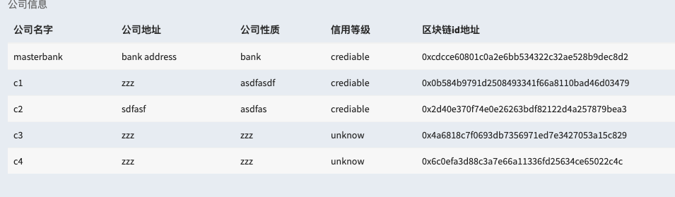


#### 2. 使用区块链私钥文件登录。

首先找到对应的私钥文件，在登陆界面进行上传，如下面为c1的私钥文件，登录后用户名就会切换为对应的名字。

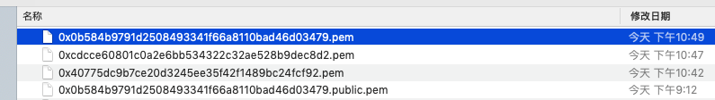

* c1登录成功


#### 3. 测试信用公司借条。

首先作为高信用的c1公司的债务具有可靠性，所以创建c1向c3借500金额，那么可以得到该债务为高信用债务。

* 创建借条

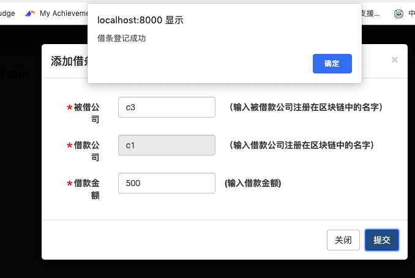

* 借条状态

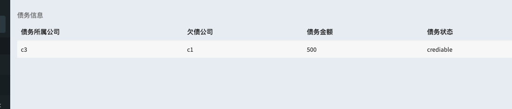

从结果可以看到符合预期，债务的状态为高信用，因为欠债公司为高信用公司。

#### 4. 测试信用借条的传递性。

这里通过两个未知信用的公司c3、c4来测试，虽然两个公司都没有信用评级，但是c3拥有c1的高信用债务，所以这里测试c3向c4转移债务。

* 转移债务

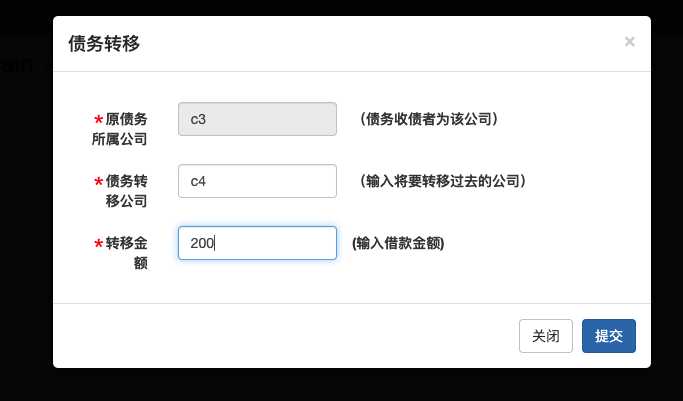

* 借条结果

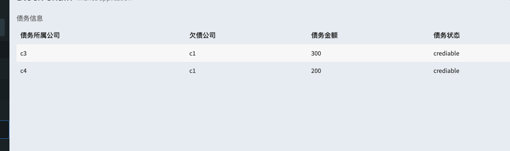

从结果上看符合预期，c3的债务中的200转移到了c4上。

#### 5. 然后是贷款，贷款会遍历所有高信用的债务。

* c3贷款

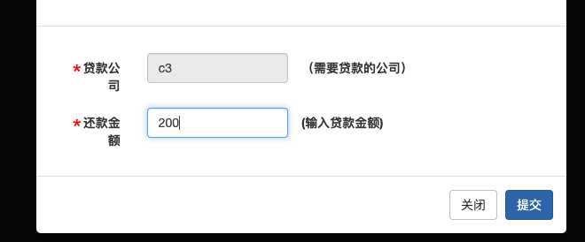

* 贷款结果

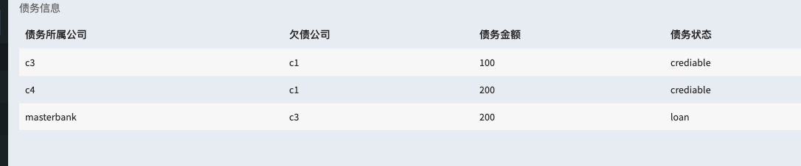

#### 6. 还款测试

* c3还c1

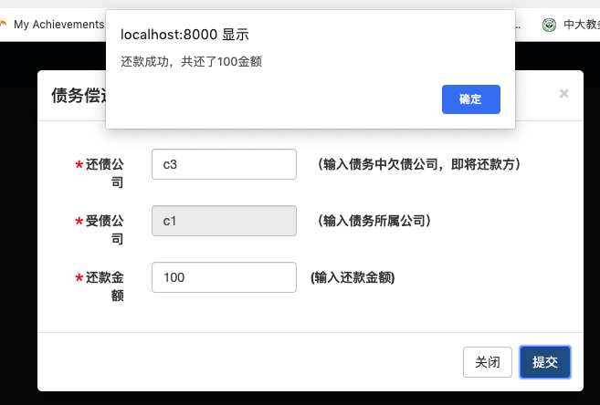

* 借条结果

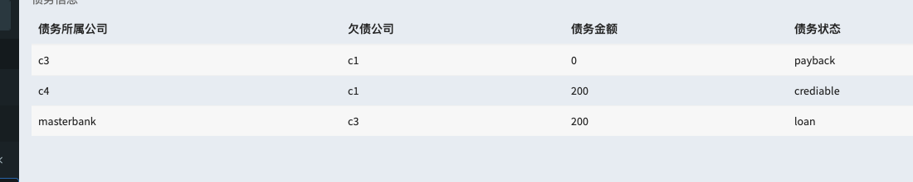


### 四、界面展示

* 登录界面

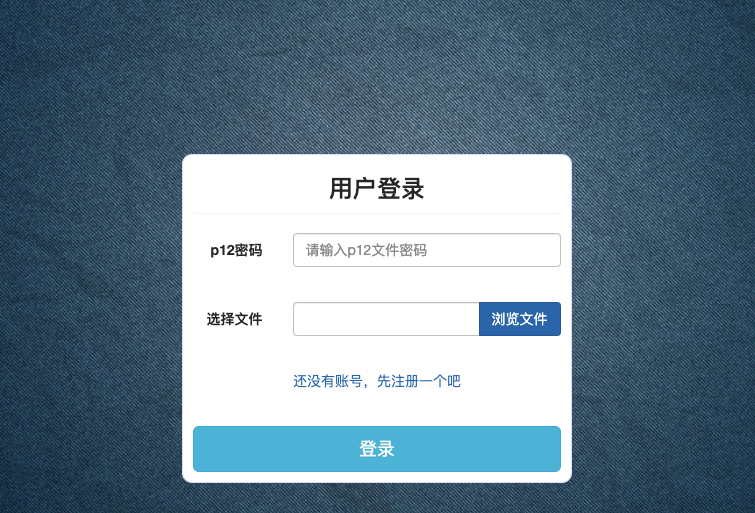

* 注册界面

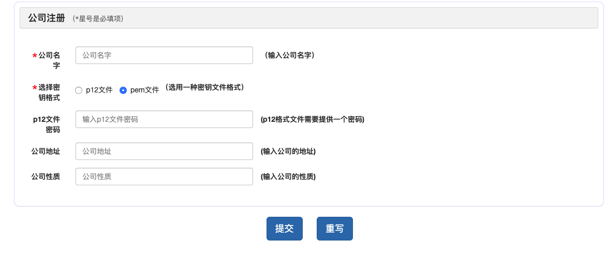

* 个人主页

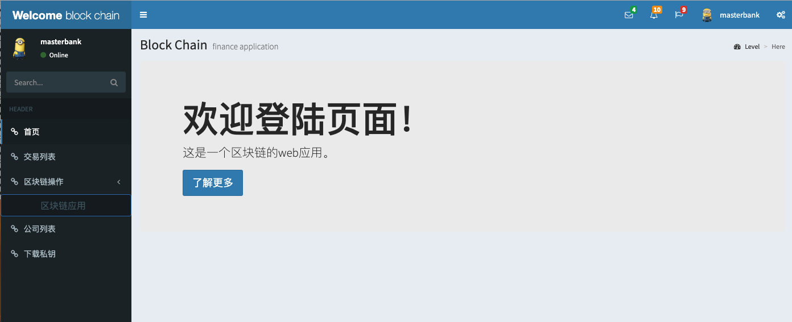

* 交易

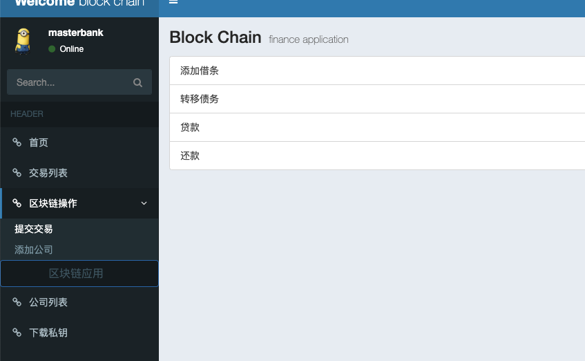

* 添加成员

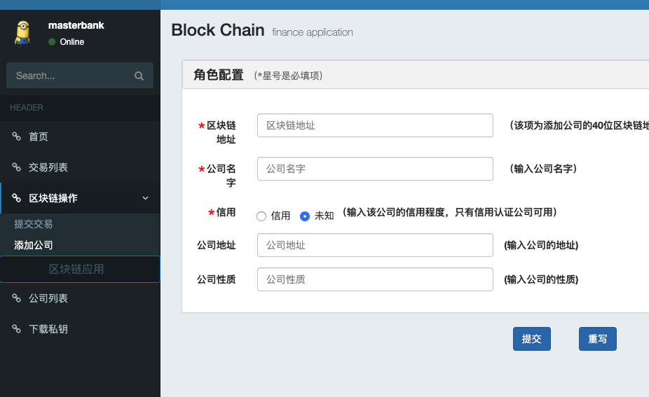

* 公司列表

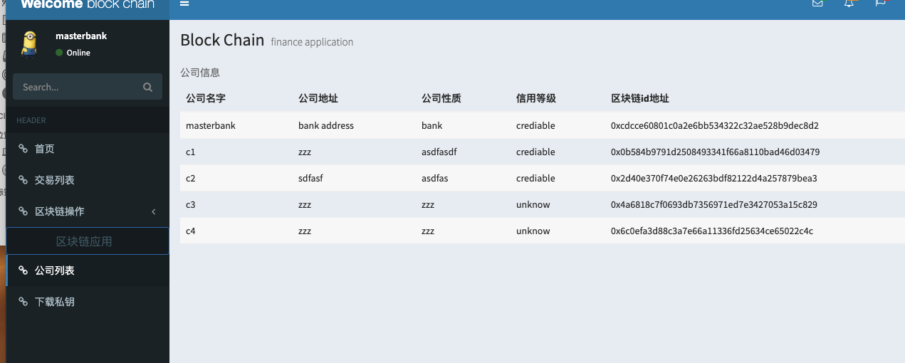

* 收据列表

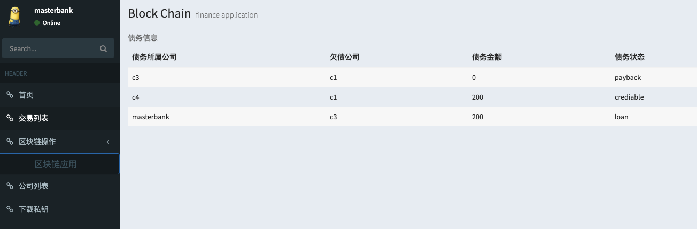

* 私钥下载

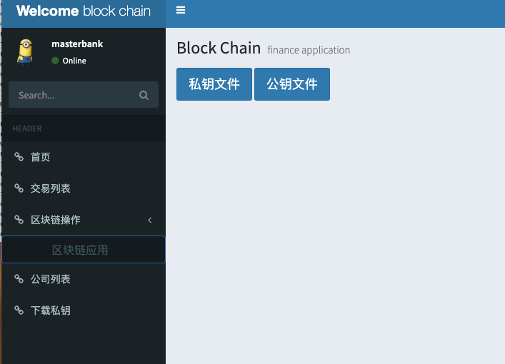

### 五、心得体会

1. 学到了很多有用的工具，这些工具在以后中也很有可能用得到，而且十分的方便。提高了自己的学习新工具以及读介绍文档的能力，在使用工具时需要读很多的使用介绍以及例子，学习多了以后学习其他的工具的速度也就有响应的提升。
2. 提高了自己的代码改错能力，同时学会了如何排除环境配置中的错误。改善了自己的代码风格，以前可能写的代码少，不太注重这一个方面，经过这次知道了自己代码存在的问题，以后也肯定会更加注意这一方面，提高代码的质量。

#### 体会：

​	这一段时间的确十分的忙，的确十分的辛苦和不容易。不过这些经历始终是要经过的，实训让我们提前感受到了以后工作中的压力，让自己能从容地面对以后发生的各种问题。

​	同时，在课堂中也学到了很多的东西，除了上面各种各样的知识和技能、提高了自己的代码能力以外，我也学会了如何解决问题，以及遇到困难问题要有坚持下去的毅力，同时也提高了自己读代码以及文档的能力，这些在以后都是十分重要的。所以说虽然十分的累，但这都是值得的。

